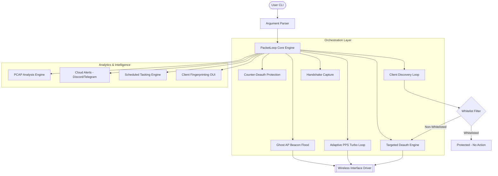
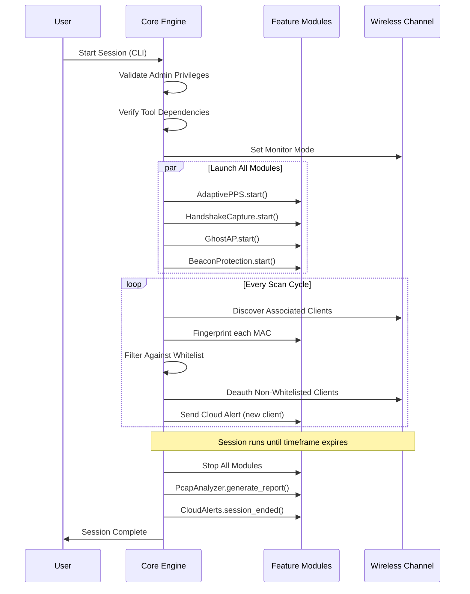

# PacketLoop: Advanced Traffic Orchestration & Deauth Suite

**PacketLoop** is a production-grade, modular network testing engine for targeted wireless traffic control. It automates deauthentication, packet looping, high-frequency injection, handshake capture, client fingerprinting, and cloud alerting in a single unified platform.

---

## System Architecture

PacketLoop operates on a multi-threaded orchestration layer that interfaces directly with raw socket drivers and packet injection suites.



---

## Module System Structure

| Module | Feature | Description |
| :--- | :--- | :--- |
| `packet_loop.py` | Core Orchestrator | Wires all modules together with CLI argument parsing |
| `handshake_capture.py` | Feature 2 | Auto-captures WPA 4-way handshakes during deauth bursts |
| `adaptive_pps.py` | Feature 3 | Dynamically adjusts injection rate based on channel congestion |
| `multi_interface.py` | Feature 4 | Manages multiple wireless adapters in parallel threads |
| `ghost_ap.py` | Feature 5 | Floods channel with phantom SSIDs using mdk4 |
| `cloud_alerts.py` | Feature 6 | Pushes real-time notifications to Discord & Telegram |
| `beacon_protection.py` | Feature 7 | Detects and counter-attacks incoming deauth frames |
| `fingerprint.py` | Feature 8 | Identifies device type (Apple, Samsung, IoT) via OUI lookup |
| `scheduler.py` | Feature 9 | Cron-like engine for scheduling sessions at specific times |
| `pcap_analyzer.py` | Feature 10 | Generates post-session statistical reports from .cap files |
| `utils.py` | Utils | MAC validation, monitor mode, interface management |

---

## Operational Flow



---

## Feature Deep-Dives

### Feature 2: Handshake Auto-Capture
| Property | Value |
| :--- | :--- |
| Module | `handshake_capture.py` |
| Tool Used | `airodump-ng`, `aircrack-ng` |
| Output | `.cap` file in `captures/` directory |
| Trigger | Automatically runs when a deauth is sent, forcing re-authentication |
| Verification | `aircrack-ng` post-check confirms EAPOL handshake presence |

### Feature 3: Adaptive PPS Control
| Property | Value |
| :--- | :--- |
| Module | `adaptive_pps.py` |
| Default Range | 100 - 3000 PPS |
| Signal Used | TX Error rate from `/proc/net/dev` |
| Behavior | Ramps up when clear; backs off on congestion |
| Update Interval | Every 2 seconds |

### Feature 4: Multi-Interface Support
- Each adapter is an independent `InterfaceWorker` thread.
- Auto-restarts failed injection processes.
- Supports different BSSIDs and PCAP files per adapter.

### Feature 5: Ghost AP Beacon Flood
- Requires: `mdk4` (`sudo apt install mdk4`)
- Generates randomized SSIDs with a configurable prefix.
- Broadcasts at 1000 beacons/sec with randomized AP MACs.
- Fully cleaned up on stop (temp SSID file deleted).

### Feature 6: Cloud Alerts
- Zero external library dependencies (pure `urllib`).
- Reads credentials from environment variables or CLI flags.
- Alert types: `new_client_detected`, `handshake_captured`, `session_ended`.
- Both Discord webhooks and Telegram Bot API supported simultaneously.

### Feature 7: Beacon Protection (Counter-Deauth)
- Requires: `tshark` (`sudo apt install tshark`)
- Sniffs for deauth frame type `0x000c` targeting protected MAC.
- Fires 50 counter-deauth frames per attack detected.
- Cooldown of 1s per source MAC to avoid loop cascades.

### Feature 8: Client Fingerprinting
- OUI prefix lookup against a local hard-coded vendor map.
- Falls back to `api.macvendors.com` for unknown OUIs.
- Runtime cache prevents duplicate API calls.
- Supports bulk fingerprinting and `filter_by_vendor()` for vendor-aware whitelisting.

### Feature 9: Scheduled Tasking
| Schedule Type | Format | Example |
| :--- | :--- | :--- |
| `once` | `"YYYY-MM-DD HH:MM"` | `"2026-06-01 03:00"` |
| `interval` | Seconds as string | `"3600"` (every hour) |
| `daily` | `"HH:MM"` | `"02:30"` |
| `weekday` | `"DAY/HH:MM"` | `"mon/14:00"` |

### Feature 10: PCAP Analysis Engine
Metrics reported post-session:

| Metric | Description |
| :--- | :--- |
| Total Packets | Frame count in the capture |
| Total Bytes | Raw data volume (KB) |
| Duration | Seconds from first to last frame |
| Packets/sec | Average injection rate |
| Bytes/sec | Average throughput |
| Unique Clients | Distinct MAC addresses seen |
| Deauth Frames | Count of type `0x000c` frames |
| Disassoc Frames | Count of type `0x000a` frames |
| WPA Handshake | Whether 4 EAPOL messages were captured |

---

## CLI Reference

### Full Argument List

| Flag | Description | Default |
| :--- | :--- | :--- |
| `-i`, `--interface` | Monitor mode wireless interface | Required |
| `-b`, `--bssid` | Target Access Point MAC | Required |
| `-w`, `--whitelist` | Space-separated MACs to protect | None |
| `-t`, `--time` | Session duration in seconds | 60 |
| `-p`, `--pcap` | PCAP file for Turbo replay | None |
| `--ghost` | Enable Ghost AP beacon flood | Off |
| `--protect MAC` | Enable Counter-Deauth for a specific MAC | Off |
| `--discord WEBHOOK` | Discord alert webhook URL | None |
| `--telegram-token` | Telegram Bot API token | None |
| `--telegram-chat` | Telegram Chat ID | None |
| `--analyze` | Run PCAP report after session | Off |

### Example Commands

**Basic Whitelisted Session:**
```bash
python packet_loop.py -i wlan0mon -b 00:11:22:33:44:55 -w AA:BB:CC:DD:EE:FF -t 300
```

**Full-Featured Session (All Modules Active):**
```bash
python packet_loop.py \
  -i wlan0mon \
  -b 00:11:22:33:44:55 \
  -w AA:BB:CC:DD:EE:FF \
  -t 600 \
  --ghost \
  --protect AA:BB:CC:DD:EE:FF \
  --discord https://discord.com/api/webhooks/... \
  --telegram-token 123456:ABC-DEF \
  --telegram-chat -100123456789 \
  --analyze
```

---

## Prerequisites

| Requirement | Install Command |
| :--- | :--- |
| Aircrack-ng Suite | `sudo apt install aircrack-ng` |
| mdk4 (Ghost AP) | `sudo apt install mdk4` |
| tshark (Counter-Deauth) | `sudo apt install tshark` |
| Python 3.10+ | `sudo apt install python3` |
| WiFi Card | Must support Monitor Mode + Packet Injection |

Recommended hardware: **Alfa AWUS036ACM** or **Alfa AWUS036ACS**.

---

## Legal Disclaimer
**FOR EDUCATIONAL PURPOSES ONLY.** PacketLoop is designed for authorized penetration testing and network security auditing. Usage of this tool on networks without explicit, written consent is illegal and may violate local and international laws. The developers assume no liability for any misuse.
