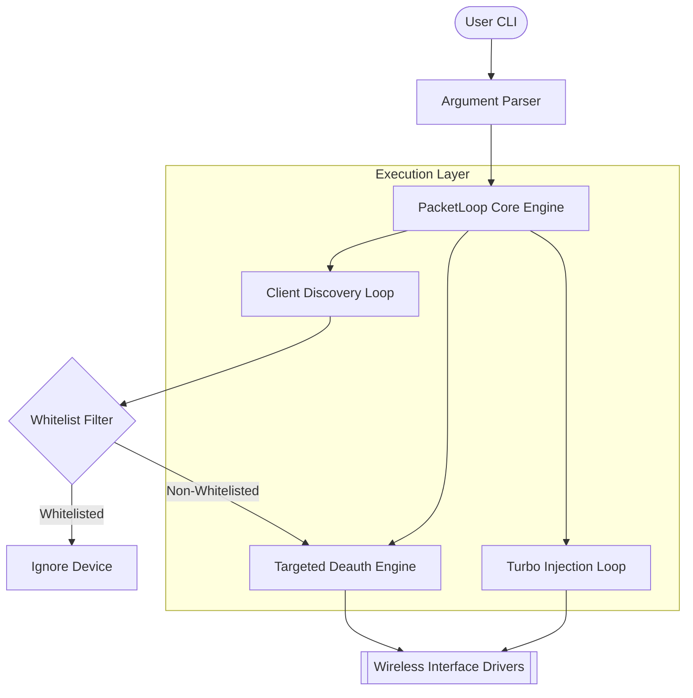
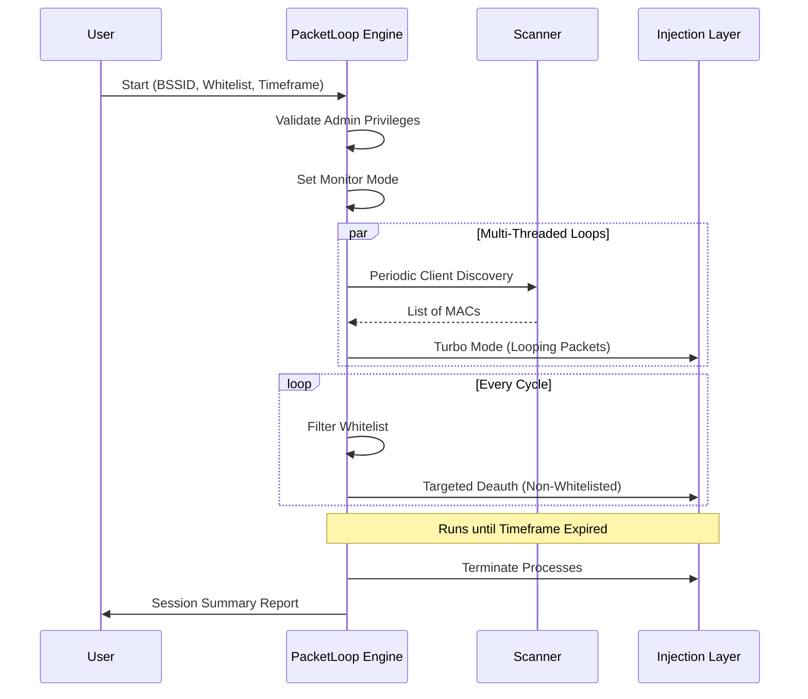

# PacketLoop: Advanced Traffic Orchestration & Deauth Suite

**PacketLoop** is a high-performance network testing engine designed for targeted traffic control in wireless environments. It combines automated deauthentication, packet looping, and high-frequency traffic injection into a single, unified orchestration platform.

---

## 🏛️ System Architecture

PacketLoop operates on a multi-threaded orchestration layer that interfaces directly with raw socket drivers and packet injection suites.

### High-Level Architecture


---

## ⚙️ System Structure

| Component | Responsibility | Technical Stack |
| :--- | :--- | :--- |
| `packet_loop.py` | Main Orchestrator & Process Manager | Python 3.10+ |
| `utils.py` | OS-Level Utility & Admin Validation | Python / C-Types |
| `aireplay-ng` | Raw WiFi Frame Injection | Aircrack-ng Suite |
| `tcpreplay` | High-Purity Traffic Re-injection | Tcpreplay Utilities |

---

## 🔄 Logic Flow (Operational Cycle)

The following flowchart illustrates the lifecycle of a PacketLoop testing session:



---

## 🛠️ Configuration & Usage

### CLI Arguments Reference

| Flag | Parameter | Description | Required |
| :--- | :--- | :--- | :--- |
| `-i`, `--interface` | `STR` | Wireless interface in monitor mode (e.g., `wlan0mon`) | Yes |
| `-b`, `--bssid` | `MAC` | Target Access Point MAC Address | Yes |
| `-w`, `--whitelist` | `LIST` | Client MAC addresses to EXCLUDE from deauth | No |
| `-t`, `--time` | `INT` | Duration of the session in seconds | No (Def: 60) |
| `-p`, `--pcap` | `PATH` | Custom PCAP for high-speed traffic looping | No |

### Execution Examples

**Standard Whitelisted Deauth:**
```bash
python packet_loop.py -i wlan0mon -b 00:11:22:33:44:55 -w AA:BB:CC:DD:EE:FF
```

**High-Frequency Traffic Stress (Turbo Mode):**
```bash
python packet_loop.py -i wlan0mon -b 00:11:22:33:44:55 -p stress_test.pcap -t 300
```

---

## 🧠 Advanced Mechanics

### 1. Targeted Deauthentication
Unlike broadcast deauth, PacketLoop executes **Targeted Deauth Loops**. By sending individual Deauth frames to specific station MACs, it preserves the connection of whitelisted devices while aggressively clearing other traffic.

### 2. Turbo Mode (Packet Looping)
The "Crazy Speed" feature is achieved by using `aireplay-ng` interactive replay modes or `tcpreplay` in high-PPS configurations. This saturates the AP's packet buffer, causing it to drop external requests while prioritizing the injected loop.

---

## ⚖️ Legal Disclaimer
**FOR EDUCATIONAL PURPOSES ONLY.** PacketLoop is designed for authorized network stress testing and security auditing. Usage of this tool on networks without explicit, written consent is illegal and may violate local and international laws. The developers assume no liability for misuse.
